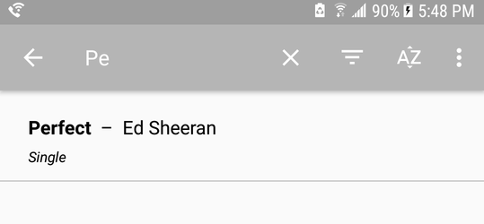

# Lyrics Buddy _Android_

#### Search, Edit, Create, View Song lyrics

## Components
#### Android API
 Lifecycle Aware
 - ViewModel
 - LiveData

 Local Storage
 - Room

 View Components
 - Fragment
 - RecyclerView

#### Custom Logic
Automatic highlighting of lyrics
- click 'display' when in view mode

#### Robust Editing tools
- Undo/Redo stack
- Fields for Essential Song Metadata

## Manage Content

#### Gallery View

#### Sort, Search, and Filter Results

#### Partial Search

#### Batch Operations
- Share
- Delete

## Create Content

_When inspiration hits_

#### Or

## Fetch Content from External Links

## View/Study Song Lyrics
See the structure of the lyrics by clicking 'display' in the action bar.
- Verses appear plain with no color span
- Chorus stanzas and repeating lines are highlighted
    - Emphasis
    - Make Distinct from Verse

Lyrics from https://www.lyricsondemand.com

#### Choose the Color Scheme
- Scheme
- Randomize

## Code Snippets

#### Applying a Filter on Search Results _Kotlin_

1) Convert query: String to tokens: Collection<String>

        // Delimit the query on ','
        val tokens = java.lang.String(query).split(",")
        val trimmedTokens = tokens.map {
            var r = if (it != null) java.lang.String(it).trim() else null

            if (r?.isEmpty() == true)
                r = null

            r
        }
        val searchableTokens = trimmedTokens.filterNotNull()

2) Declare a function that searches _field_ in _searchableTokens_

        fun containsPartialMatch(field: String): Boolean {
            return searchableTokens.find { tk -> field.contains(tk, ignoreCase = true) } != null
        }
        
3) Return list items that _containPartialMatch( field )_

        return listItems.filter {
            when (filterId) {
                R.id.menu_filter_artist -> containsPartialMatch(it.artist)
    
                R.id.menu_filter_album -> containsPartialMatch(it.album)
    
                R.id.menu_filter_track -> containsPartialMatch(it.trackTitle)
    
                // Filter on 'any' case
                else -> containsPartialMatch(it.artist) || containsPartialMatch(it.album) ||
                        containsPartialMatch(it.trackTitle)
            }
        }
        
#### Using Architecture Components _Java_

1) Get a ViewModel for the detail view scoped to the activity

        songLyricsDetailViewModel = ViewModelProviders.of(getActivity()).get(SongLyricDetailItemViewModel.class);         
        
2) Ensure the ViewModel, and underlying Repository, are connected to sqlite using Room

        songLyricsDetailViewModel.setSongLyricsDao(LyricDatabaseHelper
                    .getSongLyricDatabase(getActivity())
                    .songLyricsDao());
                    
    Song Lyrics entities are accessed by SongLyricsDao, analogous to a cursor.
    LyricsDatabaseHelper delegates opening the database                    

3) Observe Changes in SongLyrics LiveData to the view in LyricFragment   

        songLyricsObserver = new Observer<SongLyrics>() {
                    @Override
                    public void onChanged(@Nullable SongLyrics songLyrics) {
                        // Update views with content from songLyrics object 
                        trackInfo.get(R.id.title).setText(songLyrics.getTrackTitle());
                        .
                        .
                        .
                        lyrics.setText(new SpannableString(songLyrics.getLyrics()), TextView.BufferType.EDITABLE);
                   }
                   
                   LiveData<SongLyrics> songLyricsLiveData = songLyricsDetailViewModel.getSongLyrics();
                   
                   // Set the observer on the live data
                   songLyricsLiveData.observe(this, songLyricsObserver);
                   
#### Opening the Database is Easy with Room _Java_

        songLyricDatabase = Room.databaseBuilder(context,
                                SongLyricDatabase.class, DATABASE_NAME)
                                .build();              
                            
The databaseBuilder is used in a typical setup. Optionally, the database can be set up to allow access to the main thread and forcing recreation without a migration

Example

        songLyricDatabase = Room.databaseBuilder(context,
                            SongLyricDatabase.class, DATABASE_NAME)
                            .allowMainThreadQueries()
                            .fallbackToDestructiveMigration()
                            .build();
