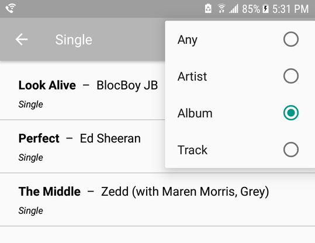
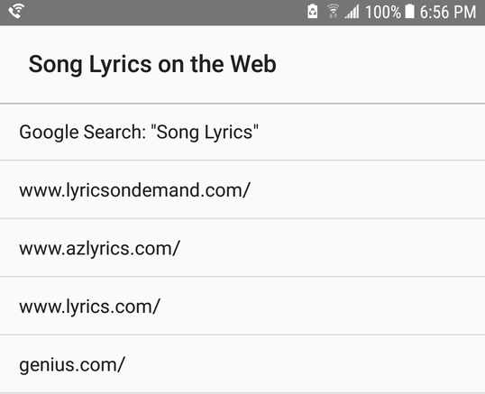
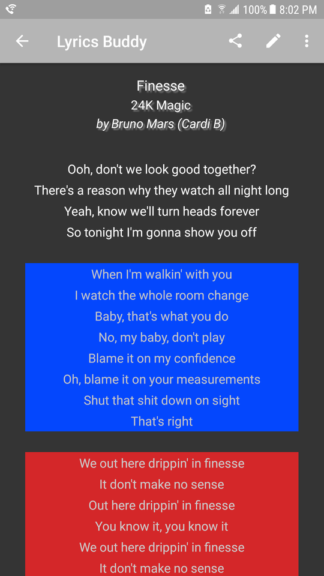

# Lyrics Buddy

#### Search, Edit, Create, View Song lyrics
for Android

## Components
#### Android API
 Lifecycle Aware
 - ViewModel
 - LiveData

 Local Storage
 - Room

 View Components
 - Fragment
 - RecyclerView

#### Custom Logic
Automatic highlighting of lyrics
- click 'display' when in view mode

#### Robust Editing tools
- Undo/Redo stack
- Fields for Essential Song Metadata

## Manage Content

#### Gallery View

#### Sort, Search, and Filter Results

#### Partial Search

#### Batch Operations
- Share
- Delete

## Create Content

_When inspiration hits_

#### Or

## Fetch Content from External Links

## View/Study Song Lyrics
See the structure of the lyrics by clicking 'display' in the action bar.
- Verses appear plain with no color span
- Chorus stanzas and repeating lines are highlighted
    - Emphasis
    - Make Distinct from Verse
- Choose the Color Scheme
    - Scheme
    - Randomize

Lyrics from https://www.lyricsondemand.com

#### Choose the Color Scheme
- Scheme
- Randomize

